# Exploratory Data Analysis on Pokémon in Python
Calling all Pokémon trainers and data enthusiasts! Prepare yourself for an exhilarating adventure as we delve into the fascinating world of Pokémon through an exploratory data analysis project. Together, we will embark on a quest to discover the strongest Pokémon, unravel the intricate web of correlations between their base stats, explore the captivating distribution of different Pokémon types, and decipher the unique strengths and weaknesses of individual Pokémon through radar charts. But our journey doesn't stop there! We will also unveil the average power wielded by each Pokémon type, determining which types reign supreme in battle. Additionally, we will investigate the capture rates of various Pokémon types, seeking to uncover any patterns that link rarity and capturability.

So, gather your Poké Balls and sharpen your analytical skills, for together, we will embark on a grand adventure, capturing the essence of Pokémon power and revealing the wonders concealed within our dataset. Are you prepared to join the ranks of the elite Pokémon researchers? Let's embark on this thrilling journey and catch 'em all!

Dataset obtained from: https://www.kaggle.com/datasets/rounakbanik/pokemon
<br />


# PART I - Importing and Reading the Dataset
```
import math
import numpy as np
import pandas as pd 
import matplotlib  
pd.plotting.register_matplotlib_converters()
import matplotlib.pyplot as plt
%matplotlib inline
import seaborn as sns
```
```
filepath = "pokemon.csv"

poke_data = pd.read_csv(filepath, 
                           index_col = 'pokedex_number')
```
# PART II - Descriptive Statistics and Data Cleanup
```
poke_data.shape
```
(801, 42)
```
poke_data.info()
```
| #   | Column             | Non-Null Count | Dtype   |
| --- | ------------------ | -------------- | ------- |
| 0   | abilities          | 801            | object  |
| 1   | against_bug        | 801            | float64 |
| 2   | against_dark       | 801            | float64 |
| 3   | against_dragon     | 801            | float64 |
| 4   | against_electric   | 801            | float64 |
| 5   | against_fairy      | 801            | float64 |
| 6   | against_fight      | 801            | float64 |
| 7   | against_fire       | 801            | float64 |
| 8   | against_flying     | 801            | float64 |
| 9   | against_ghost      | 801            | float64 |
| 10  | against_grass      | 801            | float64 |
| 11  | against_ground     | 801            | float64 |
| 12  | against_ice        | 801            | float64 |
| 13  | against_normal     | 801            | float64 |
| 14  | against_poison     | 801            | float64 |
| 15  | against_psychic    | 801            | float64 |
| 16  | against_rock       | 801            | float64 |
| 17  | against_steel      | 801            | float64 |
| 18  | against_water      | 801            | float64 |
| 19  | attack             | 801            | int64   |
| 20  | base_egg_steps     | 801            | int64   |
| 21  | base_happiness     | 801            | int64   |
| 22  | base_total         | 801            | int64   |
| 23  | capture_rate       | 801            | object  |
| 24  | classfication      | 801            | object  |
| 25  | defense            | 801            | int64   |
| 26  | experience_growth  | 801            | int64   |
| 27  | height_m           | 781            | float64 |
| 28  | hp                 | 801            | int64   |
| 29  | japanese_name      | 801            | object  |
| 30  | name               | 801            | object  |
| 31  | percentage_male    | 703            | float64 |
| 32  | sp_attack          | 801            | int64   |
| 33  | sp_defense         | 801            | int64   |
| 34  | speed              | 801            | int64   |
| 35  | type1              | 801            | object  |
| 36  | type2              | 417            | object  |
| 37  | weight_kg          | 781            | float64 |
| 38  | generation         | 801            | int64   |
| 39  | is_legendary       | 801            | int64   |
<br />

The biggest issue with this table is that the first column of the DataFrame is not the name of a Pokemon, but its abilities. While not entirely necessary, setting the first column to be the name of a Pokemon allows for much better readability. In addition, the Japanese names of the Pokemon can also be displayed next to the English name. The following code addresses this:
<br />

```
poke_name = poke_data.pop('name')
poke_data.insert(0,'name',poke_name)

poke_data.insert(1,'japanese_name',poke_data.pop('japanese_name'))
poke_data.head(11)
```
|   | name       | japanese_name       | abilities                    | against_bug | against_dark | against_dragon | against_electric | against_fairy | against_fight | against_fire | ... | pokedex_number | sp_attack | sp_defense | speed | type1 | type2 | weight_kg | generation | is_legendary | total_power |
|---|------------|---------------------|------------------------------|-------------|--------------|----------------|------------------|----------------|---------------|--------------|-----|----------------|-----------|-------------|-------|-------|-------|-----------|------------|--------------|-------------|
| 0 | Bulbasaur  | Fushigidaneフシギダネ  | ['Overgrow', 'Chlorophyll'] | 1.00        | 1.0          | 1.0            | 0.5              | 0.5            | 0.5           | 2.0          | ... | 1              | 65        | 65          | 45    | grass | poison | 6.9       | 1          | 0            | 318         |
| 1 | Ivysaur    | Fushigisouフシギソウ   | ['Overgrow', 'Chlorophyll'] | 1.00        | 1.0          | 1.0            | 0.5              | 0.5            | 0.5           | 2.0          | ... | 2              | 80        | 80          | 60    | grass | poison | 13.0      | 1          | 0            | 405         |
| 2 | Venusaur   | Fushigibanaフシギバナ   | ['Overgrow', 'Chlorophyll'] | 1.00        | 1.0          | 1.0            | 0.5              | 0.5            | 0.5           | 2.0          | ... | 3              | 122       | 120         | 80    | grass | poison | 100.0     | 1          | 0            | 625         |
| 3 | Charmander | Hitokageヒトカゲ       | ['Blaze', 'Solar Power']    | 0.50        | 1.0          | 1.0            | 1.0              | 0.5            | 1.0           | 0.5          | ... | 4              | 60        | 50          | 65    | fire  | NaN    | 8.5       | 1          | 0            | 309         |
| 4 | Charmeleon | Lizardoリザード        | ['Blaze', 'Solar Power']    | 0.50        | 1.0          | 1.0            | 1.0              | 0.5            | 1.0           | 0.5          | ... | 5              | 80        | 65          | 80    | fire  | NaN    | 19.0      | 1          | 0            | 405         |
| 5 | Charizard  | Lizardonリザードン     | ['Blaze', 'Solar Power']    | 0.25        | 1.0          | 1.0            | 2.0              | 0.5            | 0.5           | 0.5          | ... | 6              | 159       | 115         | 100   | fire  | flying | 90.5      | 1          | 0            | 634         |
| 6 | Squirtle   | Zenigameゼニガメ       | ['Torrent', 'Rain Dish']    | 1.00        | 1.0          | 1.0            | 2.0              | 1.0            | 1.0           | 0.5          | ... | 7              | 50        | 64          | 43    | water | NaN    | 9.0       | 1          | 0            | 314         |
| 7 | Wartortle  | Kameilカメール         | ['Torrent', 'Rain Dish']    | 1.00        | 1.0          | 1.0            | 2.0              | 1.0            | 1.0           | 0.5          | ... | 8              | 65        | 80          | 58    | water | NaN    | 22.5      | 1          | 0            | 405         |
| 8 | Blastoise  | Kamexカメックス         | ['Torrent', 'Rain Dish']    | 1.00        | 1.0          | 1.0            | 2.0              | 1.0            | 1.0           | 0.5          | ... | 9              | 135       | 115         | 78    | water | NaN    | 85.5      | 1          | 0            | 630         |
| 9 | Caterpie   | Caterpieキャタピー       | ['Shield Dust', 'Run Away'] | 1.00        | 1.0          | 1.0            | 1.0              | 1.0            | 0.5           | 2.0          | ... | 10             | 20        | 20          | 45    | bug   | NaN    | 2.9       | 1          | 0            | 195         |
|10 | Metapod    | Transelトランセル       | ['Shed Skin']               | 1.00        | 1.0          | 1.0            | 1.0              | 1.0            | 0.5           | 2.0          | ... | 11             | 25        | 25          | 30    | bug   | NaN    | 9.9       | 1          | 0            | 205         |


```
poke_data.tail(5)
```
|    | name       | japanese_name   | abilities           | against_bug   | against_dark   | against_dragon   | against_electric   | against_fairy   | against_fight   | against_fire   | ... | pokedex_number   | sp_attack   | sp_defense   | speed   | type1     | type2   | weight_kg   | generation   | is_legendary   | total_power   |
|----|------------|-----------------|---------------------|---------------|----------------|------------------|--------------------|-----------------|-----------------|----------------|-----|-----------------|-------------|--------------|---------|-----------|---------|-------------|--------------|----------------|---------------|
| 796| Celesteela | Tekkaguyaテッカグヤ | ['Beast Boost']     | 0.25          | 1.0            | 0.5              | 2.0                | 0.5             | 1.0             | 2.0            | ... | 797             | 107         | 101          | 61      | steel     | flying  | 999.9       | 7            | 1              | 570           |
| 797| Kartana    | Kamiturugiカミツルギ | ['Beast Boost']     | 1.0           | 1.0            | 0.5              | 0.5                | 0.5             | 2.0             | 4.0            | ... | 798             | 59          | 31           | 109     | grass     | steel   | 0.1         | 7            | 1              | 570           |
| 798| Guzzlord   | Akuzikingアクジキング | ['Beast Boost']     | 2.0           | 0.5            | 2.0              | 0.5                | 4.0             | 2.0             | 0.5            | ... | 799             | 97          | 53           | 43      | dark      | dragon  | 888.0       | 7            | 1              | 570           |
| 799| Necrozma   | Necrozmaネクロズマ | ['Prism Armor']      | 2.0           | 2.0            | 1.0              | 1.0                | 1.0             | 0.5             | 1.0            | ... | 800             | 127         | 89           | 79      | psychic   | NaN     | 230.0       | 7            | 1              | 600           |
| 800| Magearna   | Magearnaマギアナ | ['Soul-Heart']       | 0.25          | 0.5            | 0.0              | 1.0                | 0.5             | 1.0             | 2.0            | ... | 801             | 130         | 115          | 65      | steel     | fairy   | 80.5        | 7            | 1              | 600           |
<br />
Next, we can get an insight on the 'Base Stats' of Pokemon. The Base Stats consist of the 'hp', 'attack', 'defense', 'sp_attack', 'sp_defense', and speed of Pokemon.

```
base_stats = poke_data[['hp','attack','defense','sp_attack','sp_defense','speed']]
base_stats.describe()
```

|          |    hp |   attack |   defense |   sp_attack |   sp_defense |   speed |
|----------|-------|----------|-----------|-------------|--------------|---------|
| count    | 801.0 |    801.0 |     801.0 |       801.0 |        801.0 |   801.0 |
| mean     |  68.96|     77.86|      73.01|        71.31|         70.91|    66.33|
| std      |  26.58|     32.16|      30.77|        32.35|         27.94|    28.91|
| min      |   1.0 |      5.0 |       5.0 |        10.0 |         20.0 |     5.0 |
| 25%      |  50.0 |     55.0 |      50.0 |        45.0 |         50.0 |    45.0 |
| 50%      |  65.0 |     75.0 |      70.0 |        65.0 |         66.0 |    65.0 |
| 75%      |  80.0 |    100.0 |      90.0 |        91.0 |         90.0 |    85.0 |
| max      | 255.0 |    185.0 |     230.0 |       194.0 |        230.0 |   180.0 |

<br />
We can also do the same for the continous data such as height, weight, capture rate, base egg steps, experience growth, and base happiness.

```
cont_data = cont_data[['height_m', 'weight_kg', 'capture_rate', 'base_egg_steps', 'experience_growth', 'base_happiness']]
cont_data.describe()
```

|         | height_m   | weight_kg   | base_egg_steps   | experience_growth   | base_happiness   |
|---------|------------|-------------|-----------------|---------------------|------------------|
| count   | 781.000000 | 781.000000  | 801.000000      | 8.010000e+02        | 801.000000       |
| mean    | 1.163892   | 61.378105   | 7191.011236     | 1.054996e+06        | 65.362047        |
| std     | 1.080326   | 109.354766  | 6558.220422     | 1.602558e+05        | 19.598948        |
| min     | 0.100000   | 0.100000    | 1280.000000     | 6.000000e+05        | 0.000000         |
| 25%     | 0.600000   | 9.000000    | 5120.000000     | 1.000000e+06        | 70.000000        |
| 50%     | 1.000000   | 27.300000   | 5120.000000     | 1.000000e+06        | 70.000000        |
| 75%     | 1.500000   | 64.800000   | 6400.000000     | 1.059860e+06        | 70.000000        |
| max     | 14.500000  | 999.900000  | 30720.000000    | 1.640000e+06        | 140.000000       |

Now we will check to see if our dataset has any null values. 

```
poke_data.isnull().any()
```

| column             | null_count |
|--------------------|------------|
| name               | False      |
| japanese_name      | False      |
| abilities          | False      |
| against_bug        | False      |
| against_dark       | False      |
| against_dragon     | False      |
| against_electric   | False      |
| against_fairy      | False      |
| against_fight      | False      |
| against_fire       | False      |
| against_flying     | False      |
| against_ghost      | False      |
| against_grass      | False      |
| against_ground     | False      |
| against_ice        | False      |
| against_normal     | False      |
| against_poison     | False      |
| against_psychic    | False      |
| against_rock       | False      |
| against_steel      | False      |
| against_water      | False      |
| attack             | False      |
| base_egg_steps     | False      |
| base_happiness     | False      |
| base_total         | False      |
| capture_rate       | False      |
| classfication      | False      |
| defense            | False      |
| experience_growth  | False      |
| height_m           | True       |
| hp                 | False      |
| percentage_male    | True       |
| sp_attack          | False      |
| sp_defense         | False      |
| speed              | False      |
| type1              | False      |
| type2              | True       |
| weight_kg          | True       |
| generation         | False      |
| is_legendary       | False      |


We see that height_m, percentage_male, type2 and weight_kg all have null values. To gather more insight, we name the above series as NaN_column then, use .sum() function to count the instances of null values within each category. 

```
NaN_column = poke_data.isnull().any()
poke_data.isnull().sum()[NaN_column]
```
| column           | null_count |
|------------------|------------|
| height_m         | 20         |
| percentage_male  | 98         |
| type2            | 384        |
| weight_kg        | 20         |

We can see that height has 20, percentage_male has 98, type2 has 384 and weight_kg has 20 null instances. To fix this, there are a few options to explore. One is calculating the mean and plugging that into the null values, or dropping them completely. For this project, I will use a combination of both. 

```
poke_data['type2'].fillna('None', inplace=True) 
poke_data['percentage_male'].fillna('None', inplace=True)

poke_data['height_m'].fillna(poke_data['height_m'].mean(), inplace=True) 
poke_data['weight_kg'].fillna(poke_data['weight_kg'].mean(), inplace=True) 

poke_data.isnull().sum() #check for null instances again
```
| column             | null_count |
|--------------------|------------|
| name               | 0          |
| japanese_name      | 0          |
| abilities          | 0          |
| against_bug        | 0          |
| against_dark       | 0          |
| against_dragon     | 0          |
| against_electric   | 0          |
| against_fairy      | 0          |
| against_fight      | 0          |
| against_fire       | 0          |
| against_flying     | 0          |
| against_ghost      | 0          |
| against_grass      | 0          |
| against_ground     | 0          |
| against_ice        | 0          |
| against_normal     | 0          |
| against_poison     | 0          |
| against_psychic    | 0          |
| against_rock       | 0          |
| against_steel      | 0          |
| against_water      | 0          |
| attack             | 0          |
| base_egg_steps     | 0          |
| base_happiness     | 0          |
| base_total         | 0          |
| capture_rate       | 0          |
| classfication      | 0          |
| defense            | 0          |
| experience_growth  | 0          |
| height_m           | 0          |
| hp                 | 0          |
| percentage_male    | 0          |
| sp_attack          | 0          |
| sp_defense         | 0          |
| speed              | 0          |
| type1              | 0          |
| type2              | 0          |
| weight_kg          | 0          |
| generation         | 0          |
| is_legendary       | 0          |
# PART III - Analyzing the Data
1. Amount of Pokemon introduced per generation. 

```
generation_counts = poke_data['generation'].value_counts().sort_index()

plt.figure(figsize=(10,6))
sns.barplot(x=generation_counts.index, y=generation_counts.values, palette='magma')
plt.title('Number of New Pokemon Introduced per Generation')
plt.xlabel('Generation')
plt.ylabel('Number of new Pokemon')
plt.show()
```

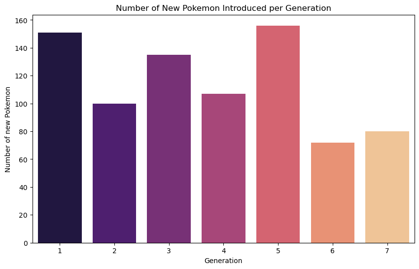

As we can observe, the generation with the most Pokemon introduced is 5. 

2. Amount of Pokemon per type per generation. 

```
type_generation_counts = poke_data.pivot_table(index='type1', columns='generation', aggfunc='size', fill_value=0)

plt.figure(figsize=(10, 8))
sns.heatmap(type_generation_counts, cmap='RdPu', annot=True, fmt='d')
plt.title('Number of Pokemon per Type and Generation')
plt.xlabel('Generation')
plt.ylabel('Type')
plt.show()
```

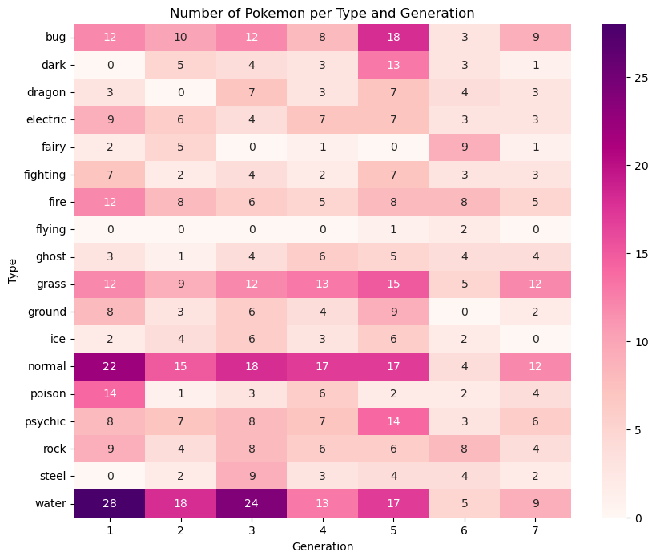
The heatmap above displays the amount of Pokemon per type and generation. From it, we observe that the 'Water' type has the highest number pof Pokemon across all generations, followed by the 'Normal' and 'Bug' types. This suggests that this type of Pokemon is more common. On the other hand, the 'Fairy' type has the lowest amount of Pokemon, indicating its rarity. This is also partially due to the fact that Fairy type Pokemon weren't introduced until Gen. 6. We can also see that the number of Pokemon per type varies across generations, with some types having more Pokemon in certain generations.
<br />
<br />
3. Primary and Secondary Type Distributions

```
import matplotlib.pyplot as plt

# Define the color dictionary
color_dict = {
    "Grass": "#358873",
    "Fire": "#E24D4D",
    "Water": "#4C75B2",
    "Bug": "#BDD358",
    "Normal": "#A6A6A6",
    "Poison": "#9C56B8",
    "Electric": "#F3CA4E",
    "Ground": "#B27350",
    "Fairy": "#F9A6FF",
    "Fighting": "#AE4C32",
    "Psychic": "#F85CFF",
    "Rock": "#A0937D",
    "Ghost": "#6C6CB1",
    "Ice": "#A7DCEC",
    "Dragon": "#3D15C3",
    "Dark": "#515151",
    "Steel": "#8D8D8D",
    "Flying": "#9696EF"
}

# Define the color dictionary with lowercase keys
color_dict_lower = {k.lower(): v for k, v in color_dict.items()}

type1_counts = poke_data["type1"].value_counts()
type1_labels = type1_counts.index
type1_percentages = (type1_counts / type1_counts.sum()) * 100

type2_counts = poke_data["type2"].value_counts()
type2_labels = type2_counts.index
type2_percentages = (type2_counts / type2_counts.sum()) * 100

fig, (ax1, ax2) = plt.subplots(1, 2, figsize=(16, 8))

type1_pie = ax1.pie(type1_percentages, labels=type1_labels, autopct="%1.1f%%", startangle=180, colors=[color_dict_lower.get(t, "#000000") for t in type1_labels])
ax1.set_title("Type 1 Distribution")

type2_pie = ax2.pie(type2_percentages, labels=type2_labels, autopct="%1.1f%%", startangle=180, colors=[color_dict_lower.get(t, "#000000") for t in type2_labels])
ax2.set_title("Type 2 Distribution")

legend_elements = [plt.Line2D([0], [0], marker="o", color="w", label=t, markerfacecolor=color_dict_lower.get(t, "#000000")) for t in type1_labels]
ax2.legend(handles=legend_elements, title="Type-Color Mapping", loc="center left", bbox_to_anchor=(1, 0.5))

plt.tight_layout()

plt.show()
```
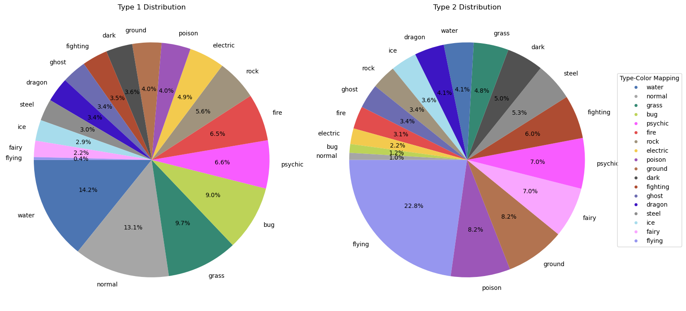

4. Correlational Statistics Between Speed and Other Base Stats. 
```
plt.scatter(poke_data["speed"], poke_data["attack"])
plt.xlabel("Base Speed")
plt.ylabel("Base Attack")
plt.title("Base Speed vs. Base Attack of Pokemon")
plt.show()

plt.scatter(poke_data["speed"], poke_data["defense"])
plt.xlabel("Base Speed")
plt.ylabel("Base Defense")
plt.title("Base Speed vs. Base Defense of Pokemon")
plt.show()

plt.scatter(poke_data["speed"], poke_data["height_m"])
plt.xlabel("Base Speed")
plt.ylabel("Height (m)")
plt.title("Base Speed vs. Height of Pokemon")
plt.show()

plt.scatter(poke_data["speed"], poke_data["weight_kg"])
plt.xlabel("Base Speed")
plt.ylabel("Weight (kg)")
plt.title("Base Speed vs. Weight of Pokemon")
plt.show()
```

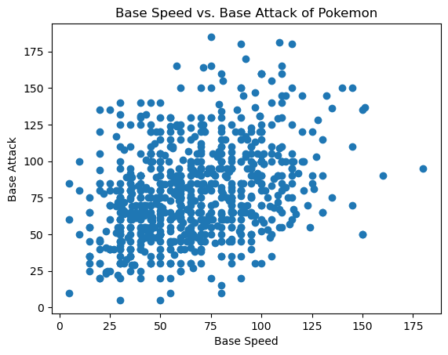
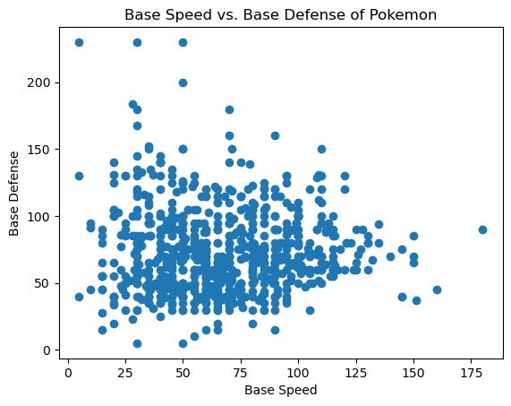
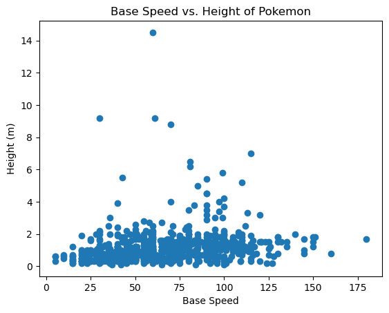
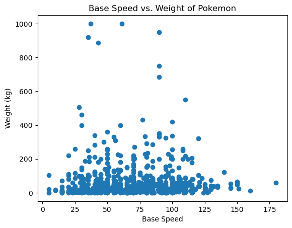

The scatter plots above display the relationships between the base speed of Pokemon and their base attack, base defense, height, and weight. 
<br />
<br />
Base Speed vs. Base Attack: There seems to be a positive correlation between base speed and base attack. This suggests that Pokemon with higher speed tend to have higher attack, which could be due to the fact that faster Pokemon can attack more frequently.
<br />
<br />
Base Speed vs. Base Defense: There doesn't seem to be a clear correlation between base speed and base defense. This suggests that these two attributes are independent of each other.
<br />
<br />
Base Speed vs. Height: There doesn't seem to be a clear correlation between base speed and height. This suggests that a Pokemon's speed is not necessarily affected by its height.
<br />
<br />
Base Speed vs. Weight: There seems to be a slight negative correlation between base speed and weight. This suggests that heavier Pokemon tend to be slower, which could be due to the fact that heavier Pokemon may require more energy to move quickly.
<br />
<br />
5. Average Total Power Per Type & Dream 6

```
# Calculate the total power for each type
poke_data['total_power'] = poke_data[['hp', 'attack', 'defense', 'sp_attack', 'sp_defense', 'speed']].sum(axis=1)
type_power = poke_data.groupby('type1')['total_power'].mean().sort_values(ascending=False)

plt.figure(figsize=(14,8))
sns.barplot(x=type_power.index, y=type_power.values, palette='magma')
plt.title('Average Total Power by Type')
plt.xlabel('Type')
plt.ylabel('Average Total Power')
plt.xticks(rotation=90)
plt.show()

sorted_data = poke_data.sort_values(by='total_power', ascending=False)

dream_team = []

types = set()

# Iterate over the sorted dataframe
for _, row in sorted_data.iterrows():
    # If the dream team already has 6 Pokemon, break the loop
    if len(dream_team) == 6:
        break
    # If the Pokemon's type1 or type2 is not in the types set, add the Pokemon to the dream team and add its types to the types set
    if row['type1'] not in types or (pd.notnull(row['type2']) and row['type2'] not in types):
        dream_team.append(row['name'])
        types.add(row['type1'])
        if pd.notnull(row['type2']):
            types.add(row['type2'])


dream_team
```
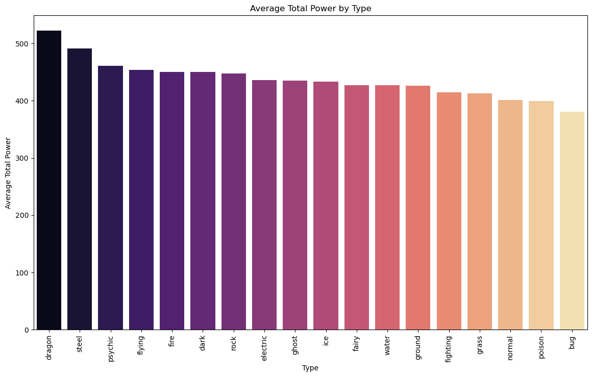
['Mewtwo', 'Rayquaza', 'Groudon', 'Kyogre', 'Arceus', 'Tyranitar']
<br />
<br />
The bar chart displays Dragon type Pokemon as the most powerful on average, while Bug type Pokemon are the weakest. I have also generated a Dream 6 team containing the most powerful Pokemon, however impractical that may be in a real game. 
<br />
<br />

6. Top Pokemon by Base Stats
```
top_defense = poke_data.nlargest(10, 'defense')[['name', 'type1', 'type2', 'defense', 'base_total', 'is_legendary']]

top_attack = poke_data.nlargest(10, 'attack')[['name', 'type1', 'type2', 'attack', 'base_total', 'is_legendary']]

top_sp_defense = poke_data.nlargest(10, 'sp_defense')[['name', 'type1', 'type2', 'sp_defense', 'base_total', 'is_legendary']]

top_sp_attack = poke_data.nlargest(10, 'sp_attack')[['name', 'type1', 'type2', 'sp_attack', 'base_total', 'is_legendary']]
```
Top 10 Pokemon by Defense:
| pokedex_number | name       | type1  | type2   | defense | base_total | is_legendary |
|----------------|------------|--------|---------|---------|------------|--------------|
| 208            | Steelix    | steel  | ground  | 230     | 610        | 0            |
| 213            | Shuckle    | bug    | rock    | 230     | 505        | 0            |
| 306            | Aggron     | steel  | rock    | 230     | 630        | 0            |
| 377            | Regirock   | rock   | None    | 200     | 580        | 1            |
| 713            | Avalugg    | ice    | None    | 184     | 514        | 0            |
| 80             | Slowbro    | water  | psychic | 180     | 590        | 0            |
| 91             | Cloyster   | water  | ice     | 180     | 525        | 0            |
| 411            | Bastiodon  | rock   | steel   | 168     | 495        | 0            |
| 95             | Onix       | rock   | ground  | 160     | 385        | 0            |
| 383            | Groudon    | ground | None    | 160     | 770        | 1            |

<br />
<br />

Top 10 Pokemon by Attack:
| pokedex_number | name       | type1  | type2    | attack | base_total | is_legendary |
|----------------|------------|--------|----------|--------|------------|--------------|
| 214            | Heracross  | bug    | fighting | 185    | 600        | 0            |
| 798            | Kartana    | grass  | steel    | 181    | 570        | 1            |
| 383            | Groudon    | ground | None     | 180    | 770        | 1            |
| 384            | Rayquaza   | dragon | flying   | 180    | 780        | 1            |
| 445            | Garchomp   | dragon | ground   | 170    | 700        | 0            |
| 354            | Banette    | ghost  | None     | 165    | 555        | 0            |
| 409            | Rampardos  | rock   | None     | 165    | 495        | 0            |
| 475            | Gallade    | psychic| fighting | 165    | 618        | 0            |
| 248            | Tyranitar  | rock   | dark     | 164    | 700        | 0            |
| 257            | Blaziken   | fire   | fighting | 160    | 630        | 0            |

<br />
<br />

Top 10 Pokemon by Special Defense:
| pokedex_number | name       | type1   | type2   | sp_defense | base_total | is_legendary |
|----------------|------------|---------|---------|------------|------------|--------------|
| 213            | Shuckle    | bug     | rock    | 230        | 505        | 0            |
| 378            | Regice     | ice     | None    | 200        | 580        | 1            |
| 382            | Kyogre     | water   | None    | 160        | 770        | 1            |
| 249            | Lugia      | psychic | flying  | 154        | 680        | 1            |
| 250            | Ho-Oh      | fire    | flying  | 154        | 680        | 1            |
| 671            | Florges    | fairy   | None    | 154        | 552        | 0            |
| 379            | Registeel  | steel   | None    | 150        | 580        | 1            |
| 380            | Latias     | dragon  | psychic | 150        | 700        | 1            |
| 476            | Probopass  | rock    | steel   | 150        | 525        | 0            |
| 703            | Carbink    | rock    | fairy   | 150        | 500        | 0            |

<br />
<br />

Top 10 Pokemon by Special Attack:
| pokedex_number | name      | type1   | type2   | sp_attack | base_total | is_legendary |
|----------------|-----------|---------|---------|-----------|------------|--------------|
| 150            | Mewtwo    | psychic | None    | 194       | 780        | 1            |
| 382            | Kyogre    | water   | None    | 180       | 770        | 1            |
| 384            | Rayquaza  | dragon  | flying  | 180       | 780        | 1            |
| 65             | Alakazam  | psychic | None    | 175       | 600        | 0            |
| 796            | Xurkitree | electric| None    | 173       | 570        | 1            |
| 94             | Gengar    | ghost   | poison  | 170       | 600        | 0            |
| 646            | Kyurem    | dragon  | ice     | 170       | 700        | 1            |
| 720            | Hoopa     | psychic | ghost   | 170       | 680        | 1            |
| 181            | Ampharos  | electric| None    | 165       | 610        | 0            |
| 282            | Gardevoir | psychic | fairy   | 165       | 618        | 0            |

<br />
<br />

7. Pokemon Radar Chart for Clefairy, Gengar, Lucario, Mewtwo
```
import math
import matplotlib.pyplot as plt
import pandas as pd

poke_data = pd.read_csv('pokemon.csv')

def create_radar_chart(pokemon_name):
    pokemon = poke_data[poke_data['name'] == pokemon_name]
    properties = ['defense', 'attack', 'sp_attack', 'sp_defense', 'hp', 'speed']

    # Get the values of the properties for the Pokemon
    values = pokemon[properties].values.flatten().tolist()
    values += values[:1]  # repeat the first value to close the circular graph

    # Calculate the angle of each axis in the plot
    num_vars = len(properties)
    angles = [n / float(num_vars) * 2 * math.pi for n in range(num_vars)]
    angles += angles[:1]

    plt.figure(figsize=(6, 6))
    ax = plt.subplot(111, polar=True)

    plt.xticks(angles[:-1], properties, color='grey', size=8)

    ax.set_rlabel_position(0)
    plt.yticks([50, 100, 150], ['50', '100', '150'], color='grey', size=7)
    plt.ylim(0, 160)

    ax.plot(angles, values, linewidth=1, linestyle='solid')

    ax.fill(angles, values, 'b', alpha=0.1)

    plt.title(pokemon_name)
    plt.show()

for pokemon in ['Clefairy', 'Gengar', 'Lucario', 'Mewtwo']:
    create_radar_chart(pokemon)
```
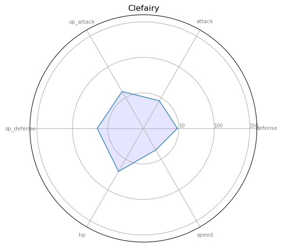
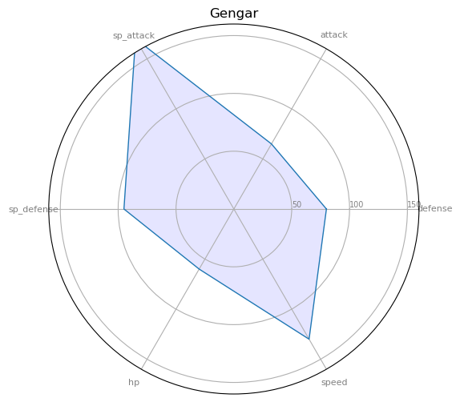
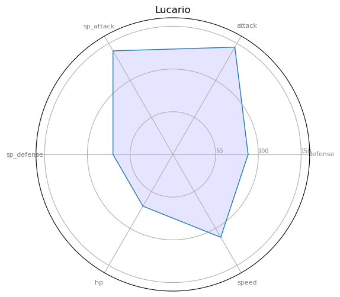
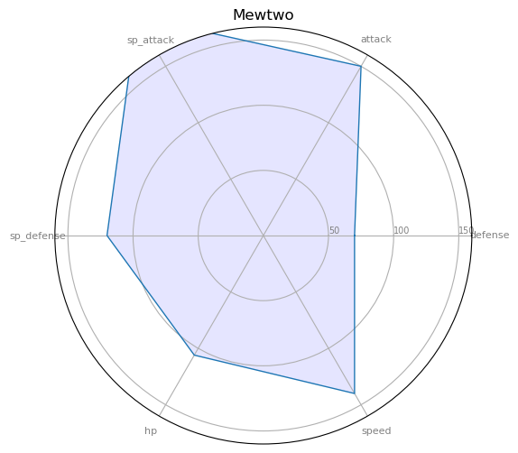

From the charts, we can observe that each Pokemon has a unique distribution of stats. For example, 'Mewtwo' has high stats in all areas, particularly in special attack, indicating that it is a powerful Pokemon in battles. On the other hand, 'Clefairy' has lower stats in general, but it has a relatively high HP, suggesting that it is a durable Pokemon. This shows that different Pokemon have their own strengths and weaknesses, and players may need to choose their Pokemon based on the specific stats they value.
<br />
<br />
8. Capture Rate by Type
```
type_capture_rate = poke_data.groupby('type1')['capture_rate'].mean().sort_values(ascending=False)

plt.figure(figsize=(14,8))
sns.barplot(x=type_capture_rate.index, y=type_capture_rate.values, palette='magma')
plt.title('Average Capture Rate by Type')
plt.xlabel('Type')
plt.ylabel('Average Capture Rate')
plt.xticks(rotation=90)
plt.show()
```
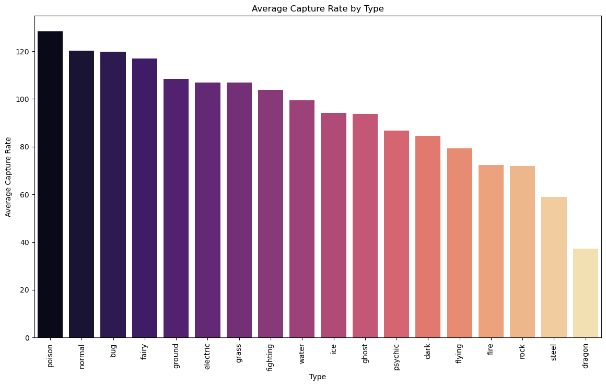
